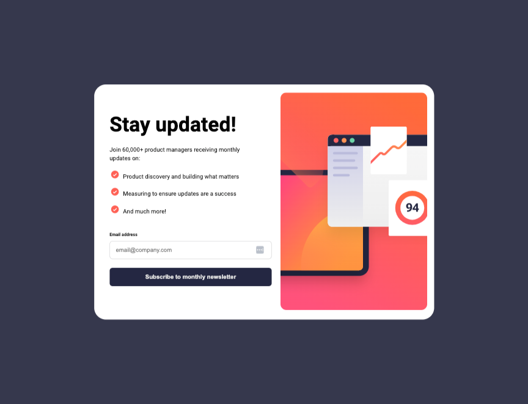

# frontend-project-newsletter-signup-form
 A Newsletter signup form with a success message all built with HTML, CSS, and JS.

## Table of contents

- [Overview](#overview)
  - [The challenge](#the-challenge)
  - [Screenshot](#screenshot)
  - [Links](#links)
- [My process](#my-process)
  - [Built with](#built-with)
- [Author](#author)

## Overview

### The challenge

Users should be able to:

- Add their email and submit the form
- See a success message with their email after successfully submitting the form
- See form validation messages if:
  - The field is left empty
  - The email address is not formatted correctly
- View the optimal layout for the interface depending on their device's screen size
- See hover and focus states for all interactive elements on the page

### Screenshot

 

### Links

- Solution URL: [https://github.com/judgemongcal/frontend-project-newsletter-signup-form]
- Live Site URL: [https://euphonious-travesseiro-db2c35.netlify.app/]

## My process

In this project, I started working with the HTML structure followed by the mobile design of the project. Once it was finished, I then switched to coding the JS functionalities. After that is finished, I moved on with the Desktop view of the project.

### Built with

- Semantic HTML5 markup
- CSS custom properties
- Flexbox
- Mobile-first workflow
- Responsive Design
- Vanilla JS

### Continued Development

After this project, I'm going to start diving deep to learn more about JS and being familiar with it enough to build more complex projects. I will also be seeking for code feedbacks/improvements from other devs online.

## Author

- LinkedIn - [@judgemongcal](https://www.linkedin.com/in/judgemongcal/)
- Frontend Mentor - [@judgemongcal](https://www.frontendmentor.io/profile/judgemongcal)